FCO-IM (Fully Communication Oriented Information Modelling) and Object-Role Modeling are both a type of Fact-Based Modeling and there exists a mapping between these methodologies for interoperability between FBM tools.

### Mapping between FCO-IM and ORM

Entity Types, as they are expressed in Object-Role Modeling, are expressed as Objectified Fact Types (usually Unary) in FCO-IM and as they would appear in Object-Role Modeling.

For instance, the Entity Type (in ORM), City, below, can be expressed in FCO-IM and ORM as an Objectified Unary Fact Type.

...can be expressed as:

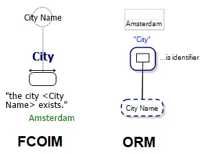

**NB** Each way of drawing the model, above, results in a Single-Attribute-Primary-Key-Entity in a Relational view of the model.

What Role (the rounded-corner-rectangle) does City Name play? It plays the role of “is identifier”, which it is.

The Entity Type in ORM, above, with the .Name Reference Mode, is shorthand for the ORM diagram:

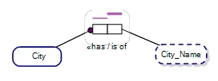

'City', in our example, is known as an Object Type in Fact-Based Modelling parlance.

In both FCO-IM and ORM can have further roles joined to an Objectified Unary Fact Type, as below:

...in FCO-IM:

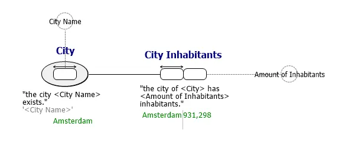

...in ORM:

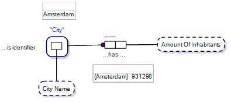

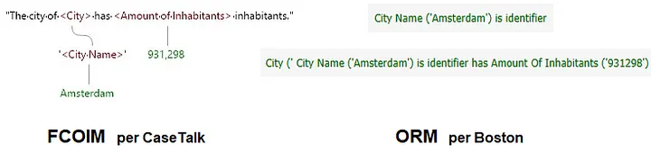

Is it controversial in Object-Role Modeling to have an Objectified Unary Fact Type with the Role joined to a Value Type in Object-Role Modeling?
It is not usual but I would say that it should not be seen as controversial.

Why?

Consider the following Object-Role Model, depicting a Stocked Item as where a Part is in a Bin in a Warehouse. I.e. An Objectified Ternary Fact Type.

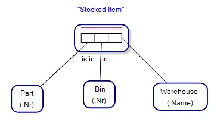

Below is what we are talking about; with a storeman picking a part from a bin in a warehouse:

If we only have one warehouse, our database may only require to store which Part is in which Bin; and so our Objectified Fact Type reduces to a Binary Fact Type.

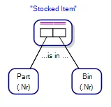

The relationship of a Part to a Bin becomes our Stocked Item.

An Objectified Unary Fact Type is simply a Fact Type with one role, as in our original example:

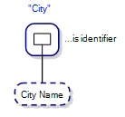

The Role (square box) played by City Name is the identifier of a City. E.g. “Sydney” is the identifer of the city, Sydney in Australia.

Putting it together we get:

...in FCO-IM:

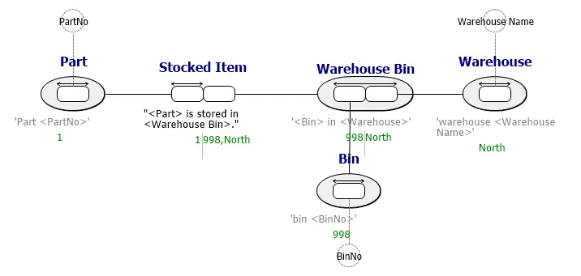

...in ORM:

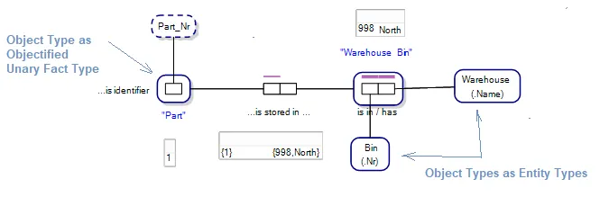

========

In Object-Role Modeling, to model our City and identified by City Name, we would model it this way:

This is shorthand for:

When providing a sample population for that Fact Type in ORM:

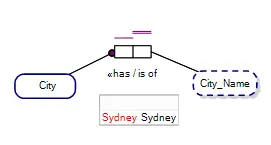

So, we are saying that the city identified by, Sydney, is identified by and has a 1:1 relationship with its City Name, Sydney. Which is a tautology.

E.g. We are not, for instance, saying that “The City identified by the number, 123, has a City Name of ‘Sydney’”; we are saying that “Something identified by ‘Sydney’ has a City Name of Sydney”. Otherwise we would have to have a Reference Mode of City_Number also, which would be turtles-all-the-way-down, which we don’t want…we want City Name to be the Reference Mode Value Type for City.

### Fact Types and Entity Types

To some extent Fact Types in Object-Role Modeling can be substituted for an Entity Type, as below:

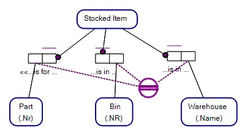

We lose the information, “Part is in Bin in Warehouse” when we just have an Entity Type for Stocked Item, that we otherwise find if the relationship represented as a Fact Type. As an Entity Type, we still have the option to have a Uniqueness Constraint across the implied relationship between a Part, Bin and Warehouse, but we lose the Fact Type Reading, and explicit representation of an association as in our original example:

Object-Role Modeling, with Link/Implied Fact Types, ties these two concepts together.

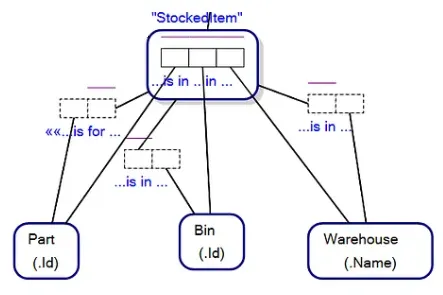

For those that really know Object-Role Modeling, for every Objectified Fact Type there is an implied Objectifying Entity Type, per Halpin’s standardisation of ORM. Viz (StockedItem) below with the three tiny roles in the rounded rectangle representing the Objectifying Entity Type implied by the Objectified Ternary Fact Type, StockedItem, above:

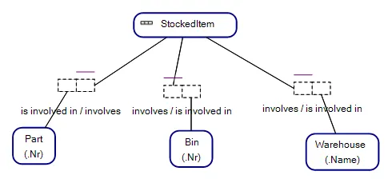

Overall, I find that the FCO-IM representation of Object Types, that may be represented as Objectified Unary Fact Type very elegant, and going forward the Boston Object-Role Modeling software will support that way of conceptual modelling beyond ORM.

=========Further information========

CaseTalk, the authors of the CaseTalk FCO-IM software have kindly provided examples of models in FCO-IM. Their counterpart in Object-Role Modeling as we move towards unifying Fact-Based Modelling for Model Exchange:

Objectified Fact Types in ORM with Roles linking to Value Types
I argue, acceptable in both FCO-IM and ORM.

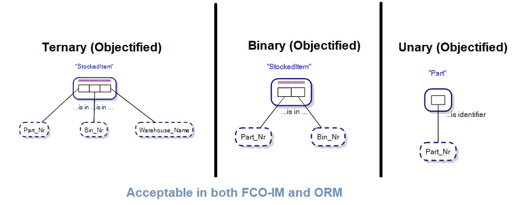

====End====

(c) Vitor Morgante

Image: Storeman reaching for a Part in a Bin in a Warehouse, via Dreamstime.com under license to Victor Morgante. ID 102810076 © Seventyfourimages | Dreamstime.com