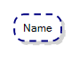
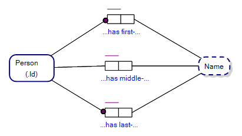
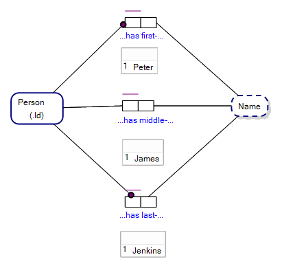
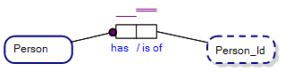
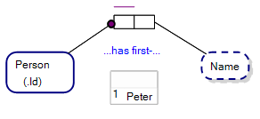
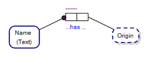

A Value Type in Object-Role Modeling represents a domain of values, rather than an Entity Type or Fact Type (association). Value types are used to represent data that does not have a separate existence outside of the object that is related to values of that Value Type.

Value Types represent data of a particular Data Type, such as integers or strings, dates or times. Value Types can also be used to represent things like codes or flags, which may be used to control the behaviour of an object or system.

Value Types range over a domain of data vales and where the name of the Value Type loosely defines the data values of roles played by that value type, within the population of Fact Types. An example Fact Type follows, but first we provide an example Value Type.

## Value Types in Object-Role Modeling

Value Types in Object-Role Modeling are drawn as round rectangles with a dashed line and the name of the Value Type within the dashed rounded rectangle, as in Figure 8.1 below.

--

The Value Type, Name, above, loosely defines the data values of roles joined to that Value Type. For example, the figure below shows where a person (entity) of the Person Entity Type must have a first and last name, may have a middle name and where first, middle and last names are all of the Value Type, Name. The data values for those names are only loosely defined by the Name Value Type, and require an interpreter’s (e.g. your) understanding of what a name is, and what are example data values for name (e.g. Peter, or, Jenkins).

The figure below shows the same three Fact Types as above with Sample Populations of data values that fill the slots of the roles of those Fact Types. The ORM diagram shows that there exists a person with a Person_Id of 1 who has the first name, Peter, the middle name, James, and the last name Jenkins.  

  

## Value Types and Reference Modes

In our examples above, Person (.Id) is shorthand for saying that each person is identified by a corresponding value for the Value Type, Person_Id (see figure below). Where an entity of an entity type is identified by a single value of a Value Type, this is known as a Reference Mode. We cover this again and in detail in the next chapter. So the shorthand notation for reference modes is another way of drawing the existence of a value type within a universe of discourse.

## Value Types as Labels
 

In the example ORM diagram in figure above, it is easy to see that a Value Type and Entity Type are labels that are given to a thing, but are not the actual thing themselves. I.e. Person is not an instance of a person, and Name is not an instance of a thing, but rather labels.  While the string ‘Peter’ may be seen as instance (thing) of the Value Type, Name, and 1 is an instance of Person_Id, neither Name, Person or Person_Id are the things they loosely describe. Together with the linking fact type they describe a person (or thing) identified by the number, 1, and with a first-name, ‘Peter’. By convention in Object-Role Modeling, ‘Peter’ only becomes a thing in our Universe of Discourse if the Value Type is converted to an Entity Type, otherwise the value ‘Peter’ is just something that describes an individual Person.

## Value Types and Entity Types

A Value Type may, if the need arises, be changed into an Entity Type within an ORM diagram as the documented universe of discourse is updated over time .

The easiest way to know whether something is a Value Type, as opposed to an Entity Type, is when you would find it particularly difficult to find sense in having a reference mode for the type, and where the name of the Value Type is what you would commonly refer to as a label of something else. E.g. Name is easily identifiable as a label of a person, but not a person.

If, however, you started to talk about names as actual things, as in onomastics (the study of names), then Name is easily envisaged as an Entity Type, as below.

For example the names Kaiser, Shar, Tsar, Qayser and various other similar names all have an origin that stems from the name Caesar, after Julius Caesar the emperor of Rome. The figure above shows that a Name, referenced by its textual form (e.g. Tsar), is an Entity Type with a universe of discourse that covers the field of onomastics, whereas in the previous figure Name is a value type.

## Inventing Value Type Names

To some, it may come as a rude shock that it is quite okay to invent labels to represent things (e.g. a Value Type called, ‘SocialSecurityId’). In ORM it is certainly okay and becomes part of the design (rather than documentation) process of ORM.

## Naming Value Types

Because a Value Type represents a set of objects, quite readily the name (or label) given to a Value Type is indicative of the unique nature of each member of the set.

For example, if the Social Security Number of each person represented in a UOD is unique, then a Value Type created to represent those numbers could be named (simply) ‘SocialSecurityNumber’.

--

(C) Copyright Victor Morgante/FactEngine.AI