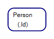
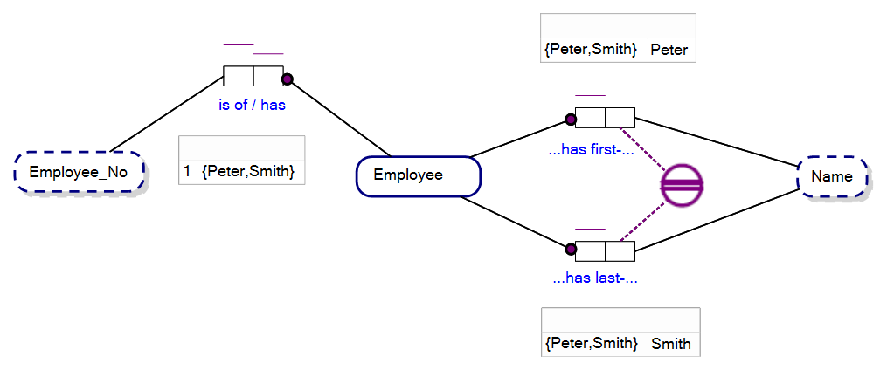
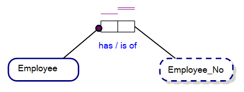
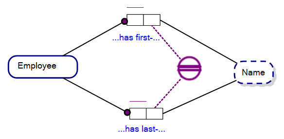
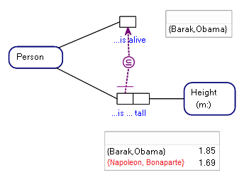

An Entity Type is a type of object that represents a set of concepts or things that have a separate and distinct existence in the real world. Entity types are used to represent the objects that the system being modelled is concerned with, such as people, organizations, products, or locations.

Each Entity Type is defined by the Roles that it plays in Fact Types that forms its association with other Entity Types, value types or objectified Fact Types. For example, a "Person" Entity Type might have attributes such as "Name," "Date Of Birth," and "Address," and play roles in Fact Types such as "Person is employee of Company" or "Person is spouse of Person" that describe the person's association with other Entity Types.

One of the best way to think of the Entity Types of FBM is to relate them to the use of nouns in everyday language. In general, whatever you would normally associate as being a noun, (e.g. ‘Person’), will translate to an Entity Type within FBM. As nouns are used in natural language, Entity Types are designed in FBM to represent a broad set of things or objects . In the same way as the word ‘Person’ does not represent any one person, an Entity Type represents a broad class of individual Entities.  

**NB** In Fact-Based Modeling we generally speak of sets of individuals rather than a Class of individuals in keeping with principals of first-order logic.  

The instances of Entity Types can be thought of as things that are identified by their relationship to other things. For instance, any one particular person may be identified by their first and last names.

Both Value Types and Entity Types are labels that are given to things. Value Types and Entity Types are not the actual ‘things’ themselves.

## How are Entity Types written in ORM?

Entity Types are represented in ORM diagrams by using a rectangular box, with the name of the Entity Type written inside.

As of ORMv2, Entity Types are drawn as rectangular boxes with rounded corners (as below).

There are three parts to the symbolic representation of an Entity.

1.	Every Entity Type has the enclosing rectangle with rounded corners (see figure above);
2.	Every Entity Type has a Name (e.g. ‘Person’ in the figure above); and 
3.	Entity Types may have a Reference Mode (e.g. ‘(PersonId)’ in figure above, or in the form (.Id) which we will discuss in this chapter).
4.	Reference Modes for Entity Types can also be written in shorthand (e.g. ‘(.Id)’) has in the figure, above.
 

The rectangular symbol, drawn with a solid line , has no particular significance other than to identify the symbol as an Entity Type . The Entity Type Name and Reference Mode warrant explanation.

## Entity Type Names

A rectangle with rounded corners with no other defining feature would be indiscernible from any other rectangle with rounded corners of the same size. So, in this light, we would expect there to be an identifier of some sort for each Entity Type, the Entity Type Name.

At a formal level, an Entity Type Name is the unique identifier for an Entity Type within the set of all Entity Types within an ORM diagram, or associated set of ORM diagrams.

More colloquially, and to relate ORM to natural language, the name of an Entity Type is merely the name you would otherwise give to a noun within the sentence that you want to express.

So, if you wanted to say, “Person owns Car”, and you identified ‘Person’ as a noun within that sentence and a subject of interest, then ‘Person’ is an appropriate Entity Type Name.

### Entity Types, Reference Modes and Reference Schemes

A **_reference scheme_** is the way that entities of an entity type are uniquely identified. A reference scheme can be:
1.	A **_simple reference scheme_** (a Reference Mode); or
2.	A **_compound reference scheme_**;

## Reference Modes / Simple Reference Schemes

The Reference Mode of an Entity Type is a way of uniquely identifying an Entity of an Entity Type. As a person, you are most familiar with this concept. You may have a nick name, and in a limited Universe of Discourse (say your family) just your nick name could identify you uniquely. Your nick name, in ORM terms, may be your Reference Mode. Similarly, if you were to join the military forces, you may be allocated a service number in a much larger UoD. That service number would then be a means of referring to you. That first name or service number may be thought of as your Reference Mode. In many database settings an integer based Reference Mode, such as service number, is quite common with the bounds of integers, for example, far exceeding conceivable nick names.

When you define an Entity Type in ORM, you may only define one Reference Mode. In the example below, within the Universe of Discourse each person is referenced by a unique identifier called, ‘PersonId’.

### Reference Modes and Relational/Graph Schema

From the point of view of a relational and graph database schema, a simple reference scheme represents where a table or node type corresponding to an entity type has a single column/property primary key, and a compound reference scheme equates to where the table has two or more columns/properties in the primary key. See the next sub-section, Compound Reference Schemes for more information.

### Reference Modes, Shortcuts and Implied Fact Types

Reference Modes may be written in short form. For example, the Reference Mode, (.Id), for a Person Entity Type intimates that each instance of a Person in our UoD is identified by their Person_Id, and where Person_Id is a Value Type in our UoD.

Each Reference Mode may be expanded to see the Fact Type, Internal Uniqueness Constraints and Value Type that form that Reference Mode, as follows:

## Compound Reference Schemes

A Compound Reference Scheme, or Composite Reference Scheme is a reference scheme where instances of a model element (Entity Type or Objectified Fact Type) are uniquely identified by instances of two or more associated Value Types.

For instance, an Entity Type, Employee, may have two associations via the Fact Types, Employee has one first-Name and Employee has one last-Name, with associated facts, “Employee, 1, has first-Name, ‘Peter’” and “Employee, 1, has last-Name, ‘Smith’”, identifying the entity, Peter Smith. The associated Value type is Name, but instances of Name are used in two contexts, first name and last name. The corresponding Object-Role Model is shown below:

 

Note that the Employee, Peter Smith, can also be identified by the Employee_No, 1, but this is not the preferred way of identifying an employee in this universe of discourse. The uniqueness of values for Employee_No in the Fact Type, Employee has Employee_No is guaranteed by the two horizontal purple bars over the roles of the Fact Type, being Internal Uniqueness Constraints. The purple round circles joining the Roles joined to the Entity Type, Employee, are Mandatory Constraints, intimating that each Employee must have a first name, last name and Employee_No. The round circle with the double horizontal bar in the middle is an External Uniqueness Constraint ensuring uniqueness of combinations of first-Name and last-Name in facts of the Fact Type, Person has first-Name and Person has last-Name, and the double bar indicates that it is the Preferred Identifier for Employee. We discuss the role of Preferred Identifiers next.

**NB** See the chapters on Fact Types and Constraints for more information on Internal Uniqueness Constraints and External Uniqueness Constraints.

### Preferred Identifiers

Instances of an Entity Type   can have identifiers and preferred identifiers, where a preferred identifier falls under what is known as the Preferred Identification Scheme .

A Preferred Identification Scheme is the preferred, or primary, way in which instances of an Entity Type or an Objectifying Entity Type (for an Objectified Fact Type) are identified within a universe of discourse. When an Object-Role Model is viewed as a relational model, for instance, preferred identifiers become primary keys against entities.

Preferred Identification Schemes are signalled within an ORM diagram as double purple bars for an Internal Uniqueness Constraint or External Uniqueness Constraint. An example of both follows below.  The figure below shows an Entity Type with a Reference Mode signalled by the Fact Type, Employee has Employee_No, with a double barred Internal Uniqueness Constraint above the role joining Employee_No, indicating both the Reference Mode and the Preferred Identification Scheme.

The figure below, indicates that instances of the Entity Type, Employee, are uniquely identified by their first-Name and last-Name and the External Uniqueness Constraint of the Preferred Identification Scheme has a double bar in its centre, as opposed a single bar for an External Uniqueness Constraint that is not a Preferred Identifier.

## Entity Types and Unit of Measure

Entity Types may represent a unit of measure. For instance, meters is as a unit of measure, and an Entity Type, Height, may represent that unit of measure, as in the figure below. Whereas we might simply say, in a Fact Type, “Person is Meter tall”, where Meter would be a Value Type, it is more common to express this as, “Person is Height (in Meters) tall”. In our example, below, we have a sample population of the Fact Type, that reads as the Fact, “Person ‘Barack Obama’ is Height (in meters), 1.85, tall.”

--

(c) Copyright Victor Morgante/FactEngine.AI