In Fact-Based Modeling, Object Types play **Roles** within **Fact Types**. For instance, ‘Object-Role Modeling’ derives its name from this premise.

## What is a Role?  

Roles are placeholders for values of an Object Type.

A person, for instance, may play the role of parent in a fact type, “Person has child-Person”, and where Person is an Object Type in our FBM diagram.

Roles are the small rectangular boxes that make up a Fact Type in Object-Role Modeling. The number of Roles in a Fact Type is known as the Arity of the Fact Type. E.g. Fact Types may be Unary, Binary, Ternary or n-Ary.

**NB** Further FBM constraints, e.g. Ring Constraints, may determine, for instance, that the same person cannot play the Role of Parent and Child within the same Fact Type.

## Mandatory and Optional Roles
Instances of an Object Type may be defined as being mandatorily playing a role or optionally.

Consider the ORM diagram below. The Roles with a purple dot are known as Mandatory Roles and require that instances of the Object Type that they join to must play the specified Role. I.e. Our model says that each Person must have a First Name and Last Name in our Universe of Discourse.

Conversely, it is optional within our UoD whether a Nick Name is recorded for a Person.

## Role Names
Roles may have Role Names, to help distinguish between Roles. The figure above, shows that the two Roles played by the Person Object Type are individually named, Parent, and Child.

**NB** Role Names may also be used as guides to the naming of Columns within Entities/Tables within a Relational or Entity-Relationship Diagram view of the Fact-Based Model. The figure below shows where the columns, ParentPersonId and ChildPersonId in the entity, Parenthood, are named respectively to their corresponding Roles.

## Roles as Place Holders for Values

The Roles of a Fact Type form effective place holders for values when we consider the Fact Tables of Fact Types. For instance, in the figure below, there is a Fact Table under the Objectified-Fact Type, StockedItem, with values filling the Role place holders for Part, Bin and Warehouse. The first row in the Fact Table shows that Part, 1, is in Bin, ‘H1’, in the ‘Sydney’ Warehouse.

Similarly we can ascertain that there are 4 items of Part, 1, in the H1 Bin in the Sydney Warehouse in the top row of the Fact Table under the Fact Type with the Fact Type Reading, “Stocked Item is in Quantity”.

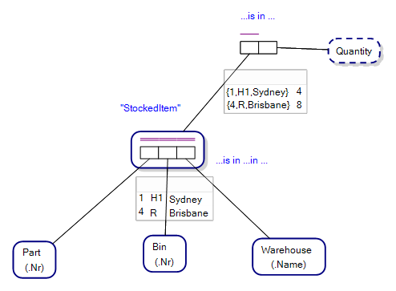

## What is a Fact Type?

A Fact Type is a collection of one or more Roles and that has a Fact Type Reading, such as “Part is in Bin in Warehouse”. See the next chapter for a detailed explanation of Fact Type Readings.

The Roles of a Fact Type form logic holes, or placeholders, for the instances/objects of the Object Types of Object-Role Modeling, Entity Types, Value Types. The graphical notation of ORM represents the logic holes of a Fact Type as Role boxes that are joined contiguously to form the graphical representation of a Fact Type.

Fact Types define the structure of Facts, such as “Part, 1, is in Bin, H1, in Warehouse, Sydney”.

For example, the figure below is a typical Object-Role Model depicting a data structure designed to store information about items in a shop that have been ordered by customers, in a quantity and on a date. The fact, “Order with Order_Nr, 1, was made on Date, 2020–12–15” conforms to the Fact Type pictorially described in the lower right of the diagram.

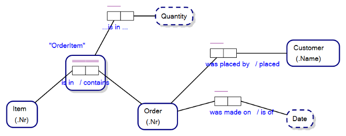  

Object-Role Models use Fact Types to define the roles played by the objects/instances of Object Types, in relation to the Facts that the Fact Types describe.

## Fact Type Readings

When we declare a Fact Type in the form Person has First Name, this is called a Fact Type Reading. A Fact Type Reading is different from a Verbalisation of a Fact Type, which would appear as Person has one First Name, for example, including the cardinality constraint.

Fact Type Readings appear also within the graphical notation of ORM, with ellipsis placeholders for the Object Types within the Fact Type. For example, in figure below, _…is showing at…on…_ represents the Fact Type, Film is showing at Cinema on DateTime when we substitute the name of the joined Object Types.

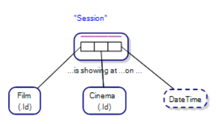

Note that a Fact Type, especially in ORM software, can have multiple Fact Type Readings. For instance, the Fact Type in Figure 10.6 above, Session, may have the following Fact Type Readings:

"Cinema is showing Film at DateTime"
"on DateTime at Cinema, Film is showing"
"Cinema at DateTime is showing Film"

…and so on.

### Hyphen Binding within Fact Type Readings

Consider the Fact Type Readings in the figure below. Both first- and last- are suffixed with a hyphen. This binds the words first and last to the Value Type, Name, in what is known as hyphen binding.

The reason for this is such that we can have one Value Type, Name, if that makes sense in our Universe of Discourse, but also such that the Verbalisation of the respective Fact Types are Person has one first-Name and Person has one last-Name, rather than Person has first one Name and Person has last one Name, which is less readable and not exactly what we want to convey.
 

## Unary, Binary, Ternary, n-Ary Fact Types
The Arity of a Fact Type is how many Roles are in the Fact Type, and a brief description of Unary, Binary, Ternary and n-Ary Fact Types follows.

### Unary Fact Types
Fact Types that have one Role are called a Unary Fact Type. For instance, Figure 10.8 shows a Unary Fact Type, “Person is eligible to vote”, where there is one Role in the Fact Type.

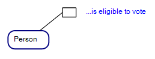

### Binary Fact Types

Fact Types that have two Roles are called a Binary Fact Type. For instance, the figure below shows a Binary Fact Type, “Person has first-Name”, where there are two Roles in the Fact Type.

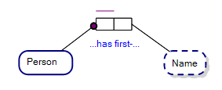

### Ternary Fact Types

Fact Types that have three Roles are called a Ternary Fact Type. For instance, the figure below shows a Ternary Fact Type, “Part is in Bin in Warehouse”, where there are three Roles in the Fact Type.

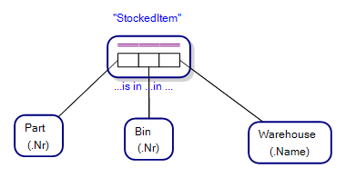

### n-Ary Fact Type

Fact Types that have more than three Roles are called an n-Ary Fact Type. For instance, the figure below shows a n-Ary Fact Type, “Major in MajorYear for Semester and StudentStatus has Unit”, where there are five Roles in the Fact Type.

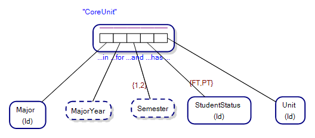

## Objectified/Nested Fact Types
An Objectified (or Nested) Fact Type is a Fact Type that has a one-to-one correspondence with an Objectifying Entity Type under the standard interpretation of ORM. Objectification in ORM is a type of reification.

Consider the following Object-Role Model diagram, where a “Stocked Item” (StockedItem) reifies the association between the Part, Bin and Warehouse Entity Types. The association is a many-to-many-to-many association where the same Part can be in more than one Bin in the same Warehouse, or a Part can be in a Bin in multiple Warehouses etc, and the combination of Part, Bin and Warehouse is always unique.

Objectified Fact Types are drawn as a set of one or more Roles surrounded by a heavy blue line, intimating that the Fact Type (the amalgamation of the Roles) is akin to an Entity Type. Figure 10.12 shows our StockedItem Objectified Fact Type, for instance.
 

In our example, the purple double-bar Internal Uniqueness Constraint across the three Roles of the Fact Type, StockedItem, indicate that the combination of instances of the Object Types, Part, Bin and Warehouse are unique.

### Objectifying Entity Types

We have previously seen that a Fact Type is a statement about an association between one or more Object Types. For example, "Person is customer of Company" is a Fact Type that relates a Person  Object Type, to a Company Object Type. In an Objectified Fact Type, the association is more complex and involves an implied Objectifying Entity Type. For example, our Fact Type, "Part is in Bin in Warehouse”, involves three Object Types: Part, Bin and Warehouse. However, it also involves an implied Objectifying Entity Type, StockedItem, which represents the association between Part, Bin and Warehouse. I.e. The Stocked Item is the association of the Part in a Bin in a Warehouse.

The Objectifying Entity Type is drawn as a normal Entity Type, but with a set of three Roles drawn to the left of the Objectifying Entity Type’s name, as in the figure below.

**NB** An Objectifying Entity Type may be used interchangeably with its corresponding Objectified Fact Type within the ORM graphical notation.

Objectified Fact Types can play Roles in other Fact Types, as in “StockedItem is in Quantity” in the figure below.
 

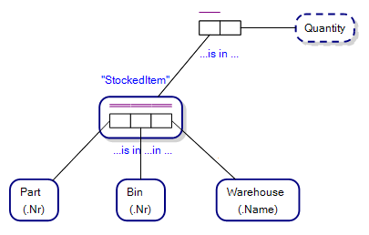

**NB** By convention, it is the Objectifying Entity Type that in actuality plays the Role, but we can draw the Role playing association directly to an Objectified Fact Type.

### The logic behind Objectified Fact Types

Object-Role Modeling stems from the graphical notation, NIAM, somewhat formalised within the PhD thesis of Terry Halpin [6], and where the thesis maps a homomorphism between the graphical notation of NIAM and theorems of a theory of Finite-Model Theory, KL (Knowledge Language). The historical detail is unknown to the author, and is perhaps private, however when Object-Role Modeling was being specified, Objectifying Entity Types appeared, and the logic works like this:

1.	In Figure 10.12, which may otherwise appear as a NIAM diagram, the association between Part, Bin and Warehouse (StockedItem) may otherwise be called a relation if one were to envisage the relationship as one under Bertrand Russell’s, Principals of Mathematics, and Russell and Whiteheads, Principia Mathematica [9][10][11];
2.	StockedItem then becomes a symbol representing the relationship;
3.	StockedItem then plays a Role in the relationship (in similar fashion) “StockedItem is in Quantity”. I.e. We have effectively employed higher-order logic in our NIAM/Object-Role Model diagram;
4.	Halpin’s PhD thesis was then in jeopardy;
5.	When specifying Object-Role Modeling, Halpin addressed the issue by a not-universally recognised (or easily debatable) mechanism where he asserted that Fact Types are not relationships over classes of objects, but rather specified associations between individuals (of Objectifying Entity Types).  And each association between individuals under a Objectified Fact Type correspond to an individual under a corresponding Objectifying Entity Type. Even if an Objectifying Entity Type never appears within the prepared set of ORM diagrams for a Universe of Discourse, they are assumed to exist.

In this way, the then association, “StockedItem is in Quantity” is not an association between a relationship and an other object, but rather an association between individuals of the Objectifying Entity Type, StockedItem, and the other of the Value Type, Quantity.

That Halpin was aware of the problem is somewhat evident in Halpin’s PhD thesis, where in section 4-6, Halpin writes [6, 4-6]:

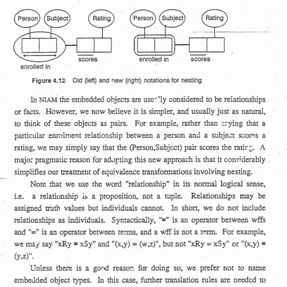

I.e. Associations = “pairs”, and where Halpin writes, “a relationship is a proposition, not a tuple. Relations may be assigned truth values but individuals cannot. In short, we do not include relationships as individuals”.

Although not specifically stated, Halpin implies that the standard interpretation of NIAM (extending now to ORM) is a notation to be interpreted as having a homomorphism to a theory of first order logic under finite-model theory, rather than with a theory of higher-order logic.

Object-Role Modeling in the modern era readily employs names for Objectified Fact Types, and it is an academic exercise as to whether an interpreter interprets Object-Role Modeling under higher-order logic or first-order logic under finite-model theory. Indeed, Halpin, for want of trying, has no say over how a system of logic is interpreted. Take, for instance, Ehrenfeucht Fraisse Games, where the duplicator is at liberty to assign whatever homomorphic, or isomorphic, theory to a set of first-order theorems as they can find, or duplicate.

It seems clear to this author that either Halpin came under private fire on the stability of Halpin’s PhD thesis, or that Objectifying Entity Types simplify the graphical notation of ORM, or both. It is this author’s contention that Halpin needed to also shore-up the original NIAM thesis, and Objectifying Entity Types go some ways to explaining Halpin’s thoughts on the matter, no matter the broader applicability to higher-order logic and criticism.

For example, Object-Role Modeling is readily used and interpreted contemporarily under higher-order logic quite successfully. The Boston conceptual modelling software, for instance, variably interprets theorems under ORM within the ORM metamodel as either under first-order logic or higher-order logic depending on what use the model is being put to (interpretation of various languages under the metamodel of ORM), and Relational.AI, a database company that has a metamodel compatible with Object-Role Modeling and uses the ORM notation within the database management system, has a programming language compatible with that metamodel that extends to higher-order logic. So, it is up to the individual how they treat the interpretation of ORM, with the understanding that the standard interpretation of ORM is as a notation homomorphic with a theory of first-order logic under finite-model theory.

## Link/Implied Fact Types

Link Fact Types are Fact Types that link an Objectified Fact Type to the Object Types joined by the Roles of the Objectified Fact Type. Link Fact Types, while not altogether necessary in converting an Object-Role Model to an Entity-Relationship Diagram/Property Graph Schema, say, play an important role in capturing the predicates between an Objectified Fact Type and the Object Types associated with that Objectified Fact Type.

Link Fact Types are also known as Implied Fact Types, and are drawn as a set of Roles with a dashed blue outline, as in the figure below.

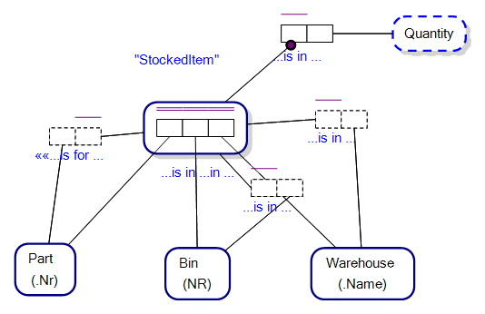

The, **_StockedItem_**, Fact Type in the figure above is objectified and its Roles join to the Object Types, **_Part_**, **_Bin_** and **_Warehouse_**. The three Link Fact Types, Stocked Item is for Part, Stocked Item is in Bin, and Stocked Item is in Warehouse, are implied, but it is the responsibility of the conceptual modeller to provide the predicates, “is for”, “is in”, and “is in”, for example.

The Objectifying Entity Type for Stocked Item can still represent the Objectified Fact Type when we consider Link Fact Types (see Figure below). The implied Fact Types between an Objectifying Entity Type/Objectified Fact Type and the Object Types that are otherwise associated by the Objectified Fact Type. The figure below shows the set of three Link Fact Types that otherwise represent the associations  between the Objectifying Entity Type, StockedItem, and its associated Object Types (as in the figure above).

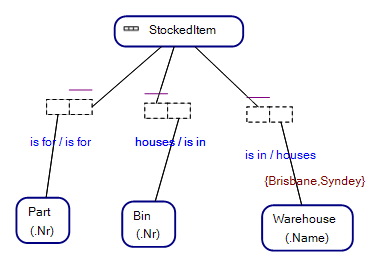

The importance of Link Fact Types becomes evident when we see that the Predicate Parts from the Fact Type Readings of the Link Fact Types are taken to form the Predicates shown against Foreign Key Relationships within a corresponding Entity Relationship Diagram of our Object-Role Model. E.g. “StockedItem is for Part”. See Figure 10.18 below.

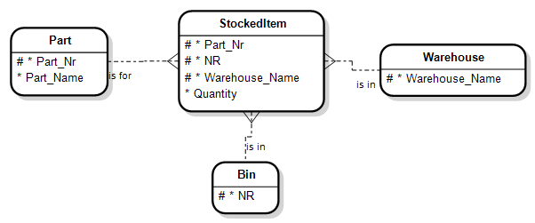

### Correspondence: Objectified Fact Types and Entity Types

We get a feel for why Objectifying Entity Types are created, even if rarely used, when we consider that an Entity Type playing a set of Roles in Fact Types can capture most of the information captured by an Objectified Fact Type.

Take, for instance, Figure 10.19 that shows an Entity Type that is not objectifying StockedItem, that plays Roles in Fact Types with Roles joining to the Object Types, Part, Bin and Warehouse. This is akin to our Figure 10.17 with an Objectifying Entity Type named, Stocked Item.

In the figure below we get an equivalent uniqueness constraint across the combination of Part, Bin and Warehouse Object types, by using an External Uniqueness Constraint, shown as the purple circle with a double-bar linked to Roles joining Part, Bin and Warehouse. The External Uniqueness Constraint sets up a Compound Reference Scheme for the Entity Type, Stocked Item.

What we lose in this type of arrangement, is that we cannot capture the Fact Type Reading, “Part is in Bin in Warehouse”, as per our Objectified Fact Type. This shortfall may be important if we have a natural language query language that can otherwise exploit Fact Type Readings, and where the question/query could be asked, “Part, 1, is in WHICH Bin, in Warehouse, ‘Sydney’?”
 
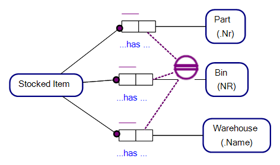

--

(c) Copyright Victor Morgante/FactEngine.AI