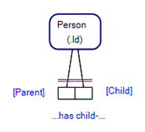
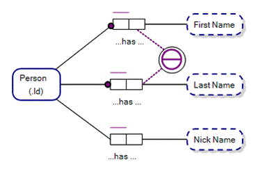
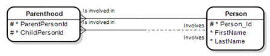

In Fact-Based Modeling, Object Types play **Roles** within **Fact Types**. For instance, ‘Object-Role Modeling’ derives its name from this premise.

## What is a Role?  

Roles are placeholders for values of an Object Type.

A person, for instance, may play the role of parent in a fact type, “Person has child-Person”, and where Person is an Object Type in our FBM diagram.

Roles are the small rectangular boxes that make up a Fact Type in Object-Role Modeling. The number of Roles in a Fact Type is known as the Arity of the Fact Type. E.g. Fact Types may be Unary, Binary, Ternary or n-Ary.

**NB** Further FBM constraints, e.g. Ring Constraints, may determine, for instance, that the same person cannot play the Role of Parent and Child within the same Fact Type.

## Mandatory and Optional Roles
Instances of an Object Type may be defined as being mandatorily playing a role or optionally.

Consider the ORM diagram below. The Roles with a purple dot are known as Mandatory Roles and require that instances of the Object Type that they join to must play the specified Role. I.e. Our model says that each Person must have a First Name and Last Name in our Universe of Discourse.

Conversely, it is optional within our UoD whether a Nick Name is recorded for a Person.

## Role Names
Roles may have Role Names, to help distinguish between Roles. The figure above, shows that the two Roles played by the Person Object Type are individually named, Parent, and Child.

**NB** Role Names may also be used as guides to the naming of Columns within Entities/Tables within a Relational or Entity-Relationship Diagram view of the Fact-Based Model. The figure below shows where the columns, ParentPersonId and ChildPersonId in the entity, Parenthood, are named respectively to their corresponding Roles.

