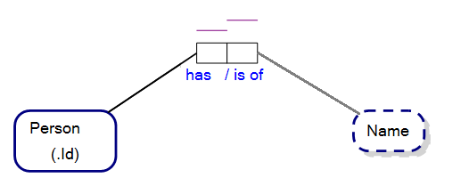
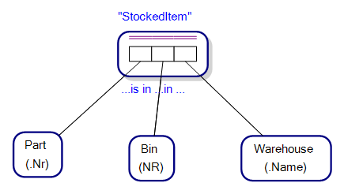

Each Fact Type has an associated Fact Type Reading.

Recall that a Fact may take the form of “Person ‘123’ has Name ‘Peter’” where 123 is a unique identifier of that person in our model.

A Fact Type Reading for the fact above would be “Person has Name”. Conversely, “Name is of Person” may be the inverse reading for the same Fact Type.

The Binary Fact Type we just analysed may be drawn as follows:

 

The **_“has”_** / **_“is of”_** predicates allow you to read the Fact Type Readings for the Fact Type as **_“Person has Name”_** and its inverse reading **_“Name is of Person”_**.

**_“has”_** and **_“is of”_** are may be called Predicate Parts of a Fact Type Reading.

 
Ternary or greater Fact Types only show the predicate parts of one of the readings for a Fact Type in the graphical notation of ORM, where each of the predicate parts are separated by ellipsis. For instance, Figure 11.2 shows the Fact Type Reading, “Part is in Bin in Warehouse”, by breaking the reading into its predicate parts and separating them by ellipsis in the corresponding ORM diagram.

## Prebound & Postbound Reading Text

Prebound and Postbound Reading Texts are single words/strings that are attached to an associated Object Type that influence the transformation of an Object-Role Model to an Entity-Relationship Diagram and/or Property Graph Schema.

For instance, in Figure 11.3, we have the Fact Type Readings, “Person has first-Name”, “Person has middle-Name” and “Person has last-Name”. The Prebound Reading Texts, “first”, “middle” and “last” are tied to the Object Type, Name, with a hyphen. This association results in field/property names, FirstName, MiddleName and LastName against the respective entity/node-type, Person, when the ORM diagram is converted to an ERD/PGS.

**NB** first-, middle- & last- in our Fact Type Readings are known as hyphen bound text in ORM.

Similarly, we may have a Fact Type Readings, “Person has Address-physical” and “Person has Address-postal”, where “physical” and “postal” are Postbound Reading Texts.

### Leading and Following Texts

In the Fact Type Reading, “sometimes Suspect travels to Country”, “sometimes” is called a Leading Text. Similarly, the Fact Type Reading, “Suspect Travels to Country sometimes” has “sometimes” as Following Text.

--

(c) Copyright Victor Morgante/FactEngine.AI