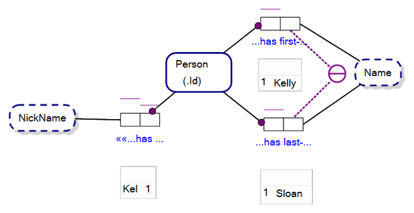
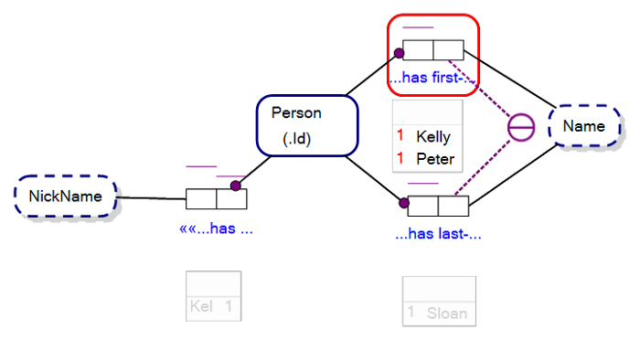
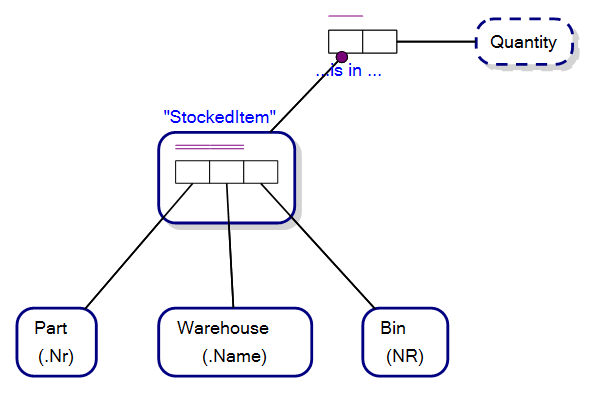
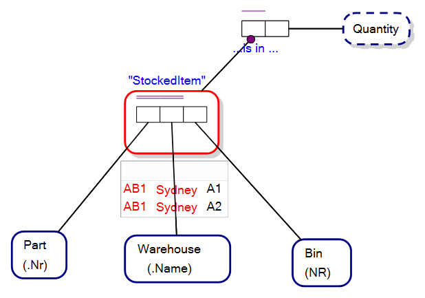
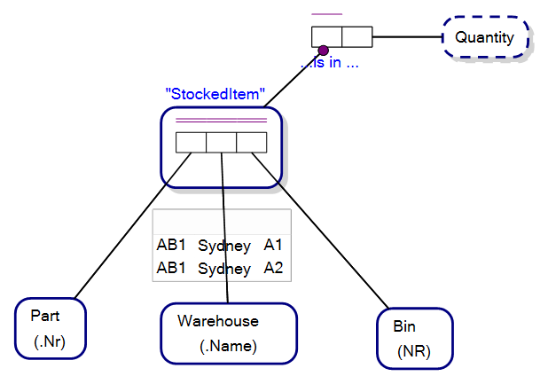

Sample Populations are data that fill the logic holes of Roles in Fact Types, and allow you to test your Object-Role Model to see that it is fit for purpose. 

Consider the typical Object-Role Model in Figure 12.1 that shows sample population data within Fact Tables under their corresponding Fact Type:

 

The model above indicates that in our Universe of Discourse each person is uniquely identified by their Person_Id, has a unique FirstName and LastName combination and a unique NickName.

The boxes under the Fact Types are sample populations. In our UoD the person, Kelly Sloan, has a Person_Id of, 1, a FirstName, ‘Kelly’, LastName, ‘Sloan’ and a NickName, ‘Kel’.  

Sample populations do not necessarily make Object-Role Modeling software that enables you to draw ORM models, a database, but rather allows for samples of what would appear in the database for those respective fact types.

Sample populations were introduced to ORM to allow the modeller to test the model to see if it is fit for purpose. For instance, if we introduced a person to our model with a FirstName of ‘Steven’ but with also a PersonId of 1 our Internal Uniqueness Constraint indicating that there is only one FirstName for each Person (in the Fact Type with reading, “Person has first-Name”) then the uniqueness constraint is violated. Our software may highlight the fact type with a red outline (i.e. contains an error) and the error may be also indicated by having both instances of the PersonId, 1, highlighted in red also within the sample population (see Figure 12.2, below).

 

At first the exercise of creating Sample Populations may seem trivially easy, but that is the purpose of sample populations…they can be used to help resolve issues when a data model is being created and discussed.

For instance, take the following Object-Role Model, mapping parts stored in bins in warehouses for an inventory management solution:

The Uniqueness Constraint within the StockedItem Fact Type is over the roles played by Part and Warehouse, indicating that within our UoD parts are only stored in one bin within a warehouse.

To help envisage the model, the following picture shows an employee reaching for a part in a bin in a warehouse:

But, what if the bins are not big enough to store the entire inventory of one part type in the warehouse? In this instance, we may elect to have the same part stored in more than one bin within the same warehouse.

Our model does not support this, so when we create a sample population expressing our new requirement and error is shown in our Object-Role Modeling software, as indicated by the red outlining around the StockedItem Objectified Fact Type:
 

To solve this problem we extend the internal uniqueness constraint to cover, Part, Warehouse and Bin, removing the error in the sample population.
 

In this example, we saw how Sample Populations in Object-Role Modeling are a tool to help you analyse and resolve your conceptual model.

--

(c) Copyright Victor Morgante/FactEngine.AI
