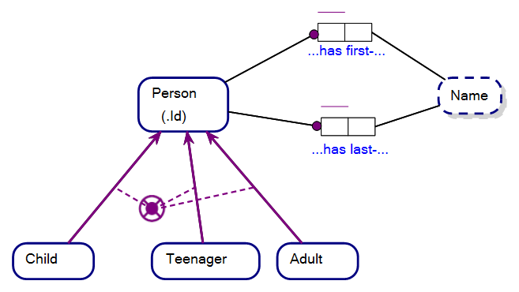
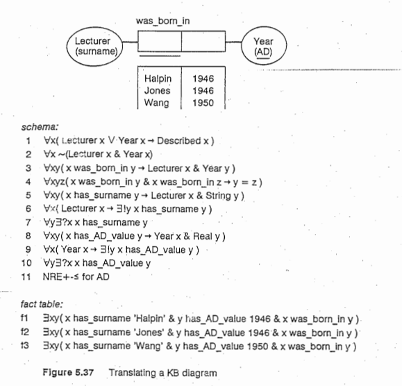

Subtypes in Object-Role Modeling are much as we picture types or classification in our day to day use of language, other than that attempts have been made to force their interpretation in certain ways under formal logic. While these attempts, in this author’s view, have not been successful, subtypes in ORM are easy to understand if you do not get bogged down by dogma and apply some simple rules.

The ORM diagram below describes a data model where each Person in our model must be a Child, Teenager or Adult, and regardless of what type of Person they are they must have a first-Name and a last-Name.

The purple arrows from the Entity Types, Child, Teenager and Adult, represent that they are each a subtype of the Entity Type, Person.

That much is fairly straight forward. It is when we examine the theory behind the standard interpretation of subtypes in Object-Role Modeling that things get interesting, and possibly confusing to the uninitiated.

The precursor to Object-Role Modeling called, NIAM, was synthesised as a language under the PhD thesis of Terry Halpin. The thesis aimed to lend credibility to the NIAM graphical language as one that was not ambiguous in any way, by mapping an homorphism from NIAM diagrams to a language of symbolic logic called KL, or Knowledge Language. KL is a theory of symbolic logic under what is known as Finite Model Theory (FMT). This attempt falls flat when we consider Ehrenfeucht Fraisse Games and variable interpretation of theorems under FMT with duplicator interpretation extended to higher-order logic, but it does not prevent Halpinites from having a standard interpretation of NIAM/ORM, all be that a limited view of logic. Let us have a look at the standard interpretation of subtypes in ORM.

In effect, Halpin’s thesis maps diagrams of NIAM with theorems of KL such that one can comparatively analyse whether a homomorphism exists or not between the languages; much the same as in the picture below taken from S5.4, Terry Halpin’s PhD Thesis.

 

The essence of theorems under finite model theory is that under their standard interpretation they are not comparable with theorems under theories of a higher order. FMT theorems are ostensibly restricted first order theorems, restricted to ranging over domains of finite order. Theories of FMT are not comparable with higher order theories in a few ways, but a distinguishing feature, for instance, is that there is no notion of a type hierarchies within a theory of finite order theory, and where objects and their labels cannot be considered as instances used in further theorem relations. I.e. You can’t pass a function/relation/association to another function/relation/association as an argument.

If ORM is ostensibly a theory under FMT, how could there be subtypes in Object-Role Modeling if there is no such thing as a type hierarchy in theories under FMT? And why?

Let us start with why. Why would you dispense with hierarchies of types in a finite model theory? The reason is that higher order theories, which do support type hierarchies, are known to be incomplete as proven by Kurt Gödel in his famous Incompleteness Theorems.

The idea of Halpinistic Object-Role Modeling, in this regard, seems to be that if one was to design a conceptual modelling language ranging over data models that govern things like the trajectory of important communications satellites, say, then the language had best be one that did not have an interpretation that was incomplete, and that could lead to disastrous data errors costing many millions of dollars to rectify if possible at all. This view is understandable as a desire, but what it lacks from the perspective of formal logic is that theorems, as written on a page/computer-screen for instance, are not the interpretation process itself. Under Ehrenfeucht Fraisse Games, for example, there exists the potential for interpretation pluralism. To the layman, this means that nobody can make you accept Halpin’s definition of a standard interpretation of ORM, but it is easy enough to recognise that there is one and that it comes with good intentions if not supported by greater formal logic, model theory when combined with real-life game theory. One who creates an ORM diagram may not be the same person/machine that interprets it, for example.

The notion of class in the context of higher-order logic is closely related to the concept of "set." In standard set theory, sets are collections of objects that satisfy certain well-defined properties, and set theory allows for the existence of sets of sets. I.e. Sets whose elements are themselves sets. However, in first-order logic/FMT, which is less expressive than higher-order logic, it is not straightforward to define and reason about sets of sets directly.

Higher-order logic extends first-order logic by allowing quantification over functions and predicates, in addition to individual objects. This increased expressive power allows higher-order logic to naturally accommodate the notion of "class." In higher-order logic, classes can be thought of as collections of objects, including sets, functions, and even other classes. The quantification over functions and predicates in higher-order logic makes it possible to define and reason about collections of objects at different levels of abstraction.

In first-order logic, quantification is restricted to individual objects, and there is no direct way to quantify over collections of objects in the same formal language. This limitation is why the notion of sets or classes as higher-level collections cannot be directly represented or reasoned about in first-order logic.

First-Order Logic (FOL): Quantification is over individual objects (individual variables). Sets or classes of objects cannot be directly represented, leading to limitations in expressing concepts related to higher-level collections.

Higher-Order Logic (HOL): Quantification is extended to include functions, predicates, and other higher-order objects. This allows the representation and reasoning about classes of objects, sets, functions, and other complex entities.

The introduction of classes in higher-order logic makes it a more powerful framework for representing a broader range of mathematical and logical concepts, including those involving collections of collections, functions, and other higher-level abstractions.
So how does Object-Role Modeling achieve the notion of subtypes, without thinking about classes, under Halpinian thinking?

### Dispending with the notion of “Class”

It was likely the thinking of wanting to avoid the “incompleteness” (and ambiguity) of higher-order logic which drove Dr Halpin to choose a theory under finite model theory to describe NIAM; a desire that each diagram had a clear and unambiguous interpretation. While this is not possible under formal logic extended to game theory/real-life, let us investigate how Halpin tried to rid of the notion of class in what are otherwise known as subtypes and supertypes. 

We must ask, “How does ORM have subtypes when such things are not supposed to exist in finite model theory”. How could Halpin have his cake and eat it? After all, it makes a language useful to be able to say that a Child is a subtype of Person. It makes communication and partitioning of a model easy.

Halpin’s trick was to pretend there was no implied hierarchy at all. The trick under Halpinian thinking is to pretend that whenever you see a purple subtype line in ORM, what you are actually seeing is an obfuscated Fact Type merely mapping a common, ordinary, everyday relation between a Child/Subtype and a Parent/Supertype. In our example then, where Child is a subtype of Person, a Fact Type exists, with readings, “Child is Parent” / “Parent is Child”. In our example, if someone happens to be a Child, by virtue of that association to Person, objects of that Child bag must have a relationship with first-Name and last-Name because that Child “is” that Person. What hierarchy? We achieve things via transitive relationships under Halpinian thinking.

Probably the best way of thinking of the implied relationship of ostensible subtypes in ORM is to not think of the objects of the relative Object Types as under any hierarchy at all. For example, let us envisage them as marbles on a tabletop, all on the same level and as below:

 
Figure 13.3   Subtype under ORM viewed as a flat transitive association

For instance, in the Boston Object-Role Modeling software, you can right-click on a purple subset line and elect to see the implied Fact Type between the “subtype” and its “supertype”, thus pretending/asserting they are not types of hierarchy at all. Figure 13.4 shows what that looks like. Viz the Fact Type at the left of the diagram with Roles marked, ‘Subtype’, and ‘Supertype’.

Once you have convinced yourself that this relationship exists, then you can right-click on the purple subtype line and hide the implied Fact Type.

Figure 13.4   Implied Fact-Type for a Subtype Relationship

Viewing “Child is Person” as not declaring a type hierarchy, but rather a association between object types of equitable conceptualisation, reduces “Child has first-Name because Child is a subtype of Person” to “Child has first-Name by virtue of a transitive association because of a special ‘is’ association between Child and Person and transitively via Person and first-Name”.

In this way the notion of hierarchy is dispensed with and we envisage the objects of Object-Role Modeling in a manner as acceptable to finite model theory, at least in theory and under a standard interpretation of ORM. While this standard interpretation of Object-Role Modeling is predicated/prescribed by Halpin’s thesis, we have seen that it is certainly not the only interpretation of sentences/diagrams written under the grammar of ORM.

## Non-Standard Interpretation of ORM

The most natural way for people to perceive of subtypes is in a Subtype/Supertype hierarchy. That is, of course, why we have such words as subtype and supertype in the first place and both with the ‘type’ suffix in the words.

Halpin’s thesis has always had a battle on its hands in that respect. Why not call the special purple lines Implied Transitive Relationships, or something similar, and not court controversy by thumbing a nose a higher order theories as unsuitable for the purposes of ORM, all the while using words with type in their name in some sort of implied hierarchy? That is, why use the words subtype and supertype, Entity Type, Value Type and Object Type at all?

Only Terry Halpin can answer that one. I suspect a combination of indifference to confusion, a rebellious nature and a sincere hope that only those suitably trained in logic/game theory would ever bother to question why. Indifference to confusion belies an opportunity for endless discussion about Object-Role Modeling. It makes for good party talk for those interested in logic. Using the suffix type to define something ostensibly synthesised as nothing of the type (pun intended) certainly also provides opportunity to defend a thesis. So let us have an interesting conversation…

Is Halpin’s thesis defensible? Are we duty bound to adopt a standard interpretation of ORM under finite model theory as the only interpretation to the necessary exclusion of all other interpretations? What if we wanted to envisage a hierarchy when we look at subtypes in an ORM diagram? What if our tendencies were toward a higher-order logical interpretation of ORM?

The good news is that you get to choose and do as you please with Object-Role Modeling under non-standard interpretation. If a higher order interpretation suits your needs and if you are aware of the consequences of jumping to higher-order logic, you go for it, nobody is going to stop you. Indeed nobody can stop you.

Protagonists of finite model theory argue that because the data objects of our focus under Object-Role Modeling invariably can be envisaged as data stored on a computer hard-drive somewhere, then you are duty bound to consider the functions ranging over that data as limited to the finite. “There is only limited physical room on a hard-drive, so data on that hard drive is necessarily finite in its size”. That is how the theory of finite model theory works at least. The reality is that you, as interpreter of that data, get to conceptualise whether it is under model ranging to the infinite of not. You are a fundamental component of the function of interpretation.

Ehrenfeucht Fraisse Games ensure this, and come under a broader notion that all of formal logic is a game of theorem sharing, interpretation and form-fitting (proving) a theory meets an interpretation. At one time you may choose to view theories of ORM under finite model theory. Another time, you might choose to view the same sentences of ORM as under a higher order logic. In fact, this is the Achilles heel of finite model theory in general…you cannot control an interpreter, you can only specify a standard interpretation and hope for the best.

## Subtypes – To be or not to be?

Quite obviously, to get along with members of the ORM community it pays to acknowledge and respect the standard interpretation of ORM that sees subtype relationships as merely transitive relationships with no hierarchy. We may as well acknowledge the game.

Under the standard interpretation of ORM subtypes are not under a hierarchy at all.

At the same time, however, if you really need to use Ehrenfeucht Fraisse Games for your research or project, then you should ask the ORM community to accept that there are cases under which ORM has valid and useful non-standard interpretations . Invariably all of logic heads towards being studied under games.

Subtypes in Object-Role Modeling open the door to interesting conversations in logic, apart from simply allowing you to say that one particular Child is one particular Person.

--

(c) Copyright Victor Morgante/FactEngine.AI
