Fact-Based Modelling uses constraints to restrict the values that may fill the place holders of Roles within Fact Types. The majority of symbols in the FBM graphical notations are dedicated to constraints and it is the extent of the vocabulary of constraint symbols that add significantly to the expressiveness of FBM.

Certain languages are tailor made for specific purposes. For example, whole dictionaries are dedicated to the vocabulary of medicine, the stock-market, the mining industry, information technology. Each of those professions has their own unique vocabulary. The vocabulary of FBM is tailor made for a specific task, and indeed, that task is to define a Universe of Discourse in sufficient detail and clarity such that the reader (or interpreter) of an FBM model has very little chance of misinterpreting what the author was expressing at the time of creating the FBM model . When looked at from that perspective (the reader, not the writer of a message), it probably becomes very clear the need for as many useful and logically sound constraints as is possible. Fact-Based Modelling certainly provides those.

As a play on words, it might be said that “FBM has its constraints”. And that is true. As with any language, there is an upper limit to what you can say with FBM, and “words may fail you”. On the whole, though, the constraint lexicon of Fact-Based Modelling is larger than many other graphical conceptual modelling languages. If ever you cannot express yourself in FBM, like most conceptual modelling languages, FBM allows the use of annotation in natural language to refine a model (Model Notes).  

## Constraints and Role Constraints  

Nearly every constraint in Fact-Based Modelling is a Role Constraint, meaning that because all constraints are over data instances, the constraint is defined as applying to the data for Roles played by Object Types.  

## 15.2 Constraints - Overview

Constraints, or Role Constraints, in Object-Role Modeling constrain the values or frequency of values for Roles within Facts of Fact Types. Most constraints within Object-Role Modeling are some form of Role Constraint; and include:

- Mandatory Role Constraints
- Internal Uniqueness Constraints
- External Uniqueness Constraints
- Ring Constraints
- Role Value Constraints
- Equality Constraints
- Value Range Constraints
- Frequency Constraints (Internal & External)
- Subset Constraints
- Subset Join Constraints
- Exclusion Constraints

## 15.3 Mandatory Role Constraints

As the name implies, a Mandatory Role Constraint is used to indicate that a Role is Mandatory and to be played by each individual identified by an Entity Type, Value Type or Nested Fact Type joined to that Role.

Mandatory Role Constraints are depicted by a solid dot covering the intersection of the Role (to which it is associated) and the line that joins the Role to the respective Entity Type, Value Type or Nested Face Type.

For instance, in Figure 15.3, it is mandatory that each Stocked Item participate in the Fact Type, Stocked Item is in Quantity.

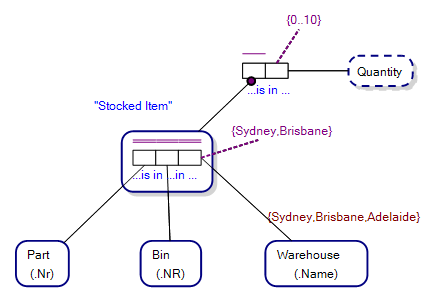

## 15.4 Internal Uniqueness Constraints

Internal Uniqueness Constraints constrain the uniqueness of values for one or more roles of a Fact Type, and are represented by purple bars over the Roles to which they relate.

Internal Uniqueness Constraints must span at least the number of Roles of the Fact Type minus one. For example, if a Fact Type has three Roles, any Internal Uniqueness Constraint over the Roles of the Fact Type must at least span two Roles.

For example, the horizontal purple bar within the Fact Type in Figure 15.4, below, is an Internal Uniqueness Constraint. Because it is over the Role played by Order, each occurrence of an Order_Nr (e.g. 145) within the Fact Type may occur exactly once within instances of that Fact Type. That is, each occurrence of Order_Nr within a population the Fact Type is unique.

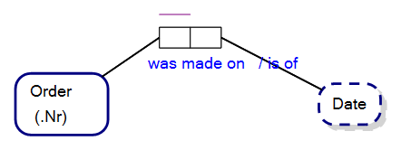

### 15.4.1 Cardinality and Internal Uniqueness Constraints

Internal Uniqueness Constraints can also be read as defining relative cardinality, as in a date can have many orders, but each order has only one date. The relationship is a many-to-one relationship (Figure 15.4).

If each Order in our Universe of Discourse can be made on only one date, and each Date can have only one order, we can use internal uniqueness constraints to define this one-to-one relationship, as follows:

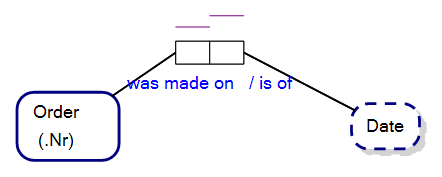

A many-to-many relationship can be established where the internal uniqueness constraint spans more than one role, as follows:

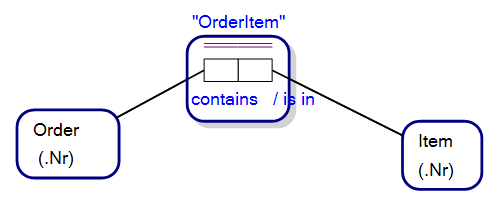

The internal uniqueness constraint spanning the roles played by Order and Item in the fact type, OrderItem, means that any one order can have many Items, and each Item can be included in more than one order; each combination of instances of Order_Nr and Item_Nr is unique.

**NB** When the Internal Uniqueness Constraint bar is represented by a double line (as above), this means that the uniqueness constraint represents the Preferred Reference Scheme for the corresponding conceptual object; in this case, OrderItem.

**NB** In each case we have investigated, note that the bar of the Internal Uniqueness Constraint spans at least n minus one roles of the corresponding fact type, where n is the number of roles in the fact type. For instance, the following two diagrams say the same thing while presented as structurally different ORM diagrams:

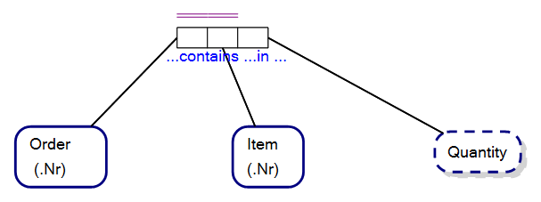

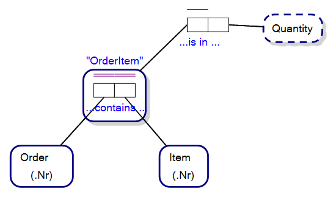

### 15.4.2 Binary Fact Types and Internal Uniqueness Constraints

Internal Uniqueness Constraints over Binary Fact Types determine whether the binary relationship is a:

- Many-to-One relationship
- One-to-Many relationship
- Many-to-Many relationship
- One-to-One relationship

### 15.4.3 Preferred Reference Schemes

An Internal Uniqueness Constraint that is the Preferred Identifier for a Fact Type is drawn as a double line, rather than a single straight line.

When used in the Fact Type that represents the Simple Reference Scheme of an Object Type (usually an Entity Type), indicates the scheme (usually a Value Type) that ultimately provides the unique domain of values for that Object Type.

For example, in Object-Role Modeling, when an Entity Type, such as Order (Figure 15.8), has a bracketed Reference Mode, as in (.Nr) for Order, this is known as the Preferred Reference Scheme for the Entity Type. ".Nr" is known as the Reference Mode of Order. This means that Order_Nr (the extrapolated name for the Value Type for the Reference Scheme) for each Order is unique (Figure 15.9). ".Nr", the Reference Mode, is short, then, for Order_Nr in this example.

This can be confusing to the uninitiated, and is best exemplified by expanding the Reference Scheme so that we can see what is going on (Figure 15.9, below):

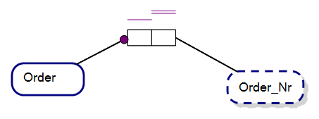

Expanded, it is easy to see that each Order has a one-to-one relationship with the corresponding Order_Nr, and the double-bar Internal Uniqueness Constraint on the role joining Order_Nr indicates that this is the Preferred Reference Scheme for the Order Entity Type.

For those familiar with Entity-Relationship Diagrams for Relational Databases, this is the equivalent of saying that Order_Nr is the primary key for the entity, Order; as follows:

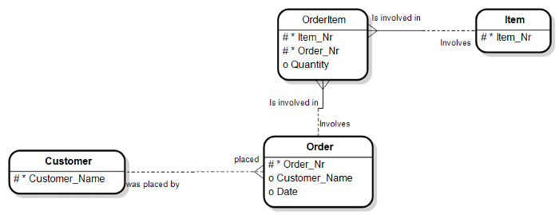

### 15.4.4 Summary of Internal Uniqueness Constraints

Internal Uniqueness Constraints in Object-Role Modeling are represented by purple bars that span the Roles over which the uniqueness constraint applies. When the bar is doubled it indicates that the Internal Uniqueness Constraint represents the Preferred Reference Scheme for the corresponding conceptual object, and each Internal Uniqueness Constraint spans at least n minus one Roles, where n is the number of Roles in the corresponding Fact Type.

## 15.5 External Uniqueness Constraints

The following is a typical Object-Role Model:

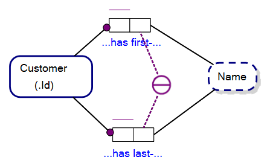

The purple circle with a horizontal bar, above, is an External Uniqueness Constraint in ORM.

In our example, the constraint intimates that each Customer in our data model has a unique combination of FirstName and LastName.

External Uniqueness Constraints are differentiated from Internal Uniqueness Constraints which are localised to singular Fact Types and are the purple bars adjacent to the Roles to which they relate.

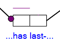

### 15.5.1 Preferred Reference Scheme & External Uniqueness Constraints

In our example (Figure 15.11), each Customer is uniquely identified by their Customer_Id, as indicated by the Reference Mode, ".Id", on the Customer entity type, as below.

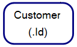

But what if we preferred to reference each instance of Customer by their FirstName/LastName combination?

In that case, we can change our External Uniqueness Constraint (Figure 15.11) to one that indicates that it is the Preferred/Primary Reference Scheme for the corresponding model element (Customer) by changing the internal bar of the External Uniqueness Constraint to a double line (Figure 15.15, below)

**Primary Identifier - External Uniqueness Constraint**

If an External Uniqueness Constraint is marked as a Preferred/Primary Identifier (two horizontal lines instead of one within the constraint circle), then the External Uniqueness Constraint represents the Primary Reference Scheme for the Entity Type that is common to the Fact Types linked by the External Uniqueness Constraint;

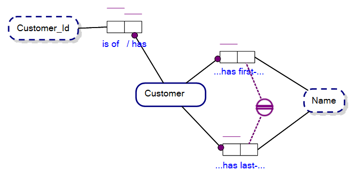

**NB** Customer_Id is still a unique identifier for each Customer instance, but our Preferred Reference Scheme is now FirstName/LastName.

This combination of unique ways to identify a customer is easily visible when we convert our Object-Role Model to an Entity Relationship Diagram, as follows:

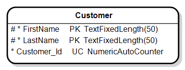

Note that the Primary Key (PK) of our Customer entity is over the FirstName and LastName columns, and that we have a uniqueness constraint, UC, over the Customer_Id column.

## 15.6 Elementary Equivalence and External Uniqueness Constraints

Consider the following ORM diagram which defines how a StockedItem is conceptually the combination of a Part in a Bin in a Warehouse:

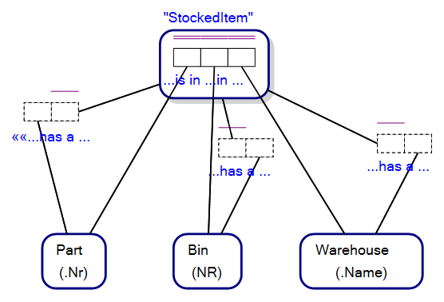

**NB** The Fact Types with dashed lines, are Link/Implied Fact Types. What we are interested in is the Internal Uniqueness Constraint spanning the three Roles in the StockedItem Objectified Fact Type.

Can we achieve an elementary equivalent conceptualisation of StockedItem using an External Uniqueness Constraint?

The answer is yes; if we conceptualise StockedItem as an Entity Type, rather than an Objectified Fact Type, and use an External Uniqueness Constraint as the Preferred Reference Scheme for StockedItem (Figure 15.18 below).

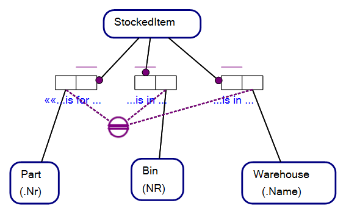

**NB** We lose the Fact Type, "Part is in Bin in Warehouse", under this treatment but we achieve our elementary equivalence. But if we lose information, how is it that the models are elementary equivalent?. Both models resolve to the same entity relationship diagram, and where the relational model contains less information than an Object-Role Model (Figure 15.19 below):

### 15.6.1 Summary of External Uniqueness Constraints

External Uniqueness Constraints in Object-Role Modeling span more than one Role and where each Role is in a different Fact Type.

They are particularly useful to provide a Preferred Reference Scheme for Entity types that have a Compound/Composite Key when reduced to a relational model, or as similar for a graph database.

## 15.7 Ring Constraints

Ring Constraints constrain values over two Roles, where both Roles join compatible Object Types (often the same Object Type) and where the three concepts (two Roles and an Object Type) form an effective ring. The Roles of a Ring Constraint need not be within the same Fact Type.

As an example, a Ring Constraint can express that if a person is parent of a second person, then it is not possible that that second person is parent of the first person. This is known as an Asymmetric Intransitive Ring Constraint.

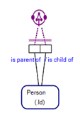

The following is how the Verbalisation of the Ring Constraint in Figure 15.20 would appear in Object-Role Modeling software:

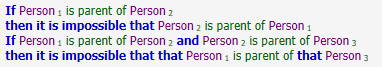

There are over 14 different types of Ring Constraint in Object-Role Modeling as listed below. The logical interpretation of the various Ring Constraint symbols is in the name of the Ring Constraint symbol, but also an attempt has been made to guide the interpreter of the Ring Constraint as to its interpretation within the symbol itself. E.g. The symbol for an Irreflexive Ring Constraint has a dot, and a circle with a bar crossing it, intimating that an association does not allow cycling back to an Object Type's self.

**Hint:** In Object-Role Modeling software, if you click on the Ring Constraint within the model, you can read the verbalisation of the Ring Constraint in natural language, which will help you to understand the ring constraint and/or verify whether you are using the right Ring Constraint/Symbol.

| Name of Ring Constraint Symbol | Ring Constraint Symbol |
|--------------------------------|------------------------|
| Acyclic Strongly Intransitive | |
| Irreflexive | |
| Asymmetric | |
| Intransitive | |
| Antisymmetric | |
| Acyclic | |
| Asymmetric Intransitive | |
| Acyclic Intransitive | |
| Symmetric ||
| Symmetric Irreflexive ||
| Symmetric Intransitive ||
| Symmetric Transitive ||
| Purely Reflexive ||
| Transitive ||

## 15.8 Role Value Constraints

Role Value Constraints constrain values for Roles of Fact Types and are drawn as a set of values between braces, all in purple, and with a dashed purple line link to the Role to which the constraint applies. The set of possible values for instances of the Object Type linked by the Role, for Facts that include that Role, are restricted to the values within the braces of the Role Value Constraint.

For instance, in Figure 15.22 below, for each association of a Part to a Bin in a Warehouse within a Fact of the Fact Type, Stocked Item, values of Warehouse_Name of the Entity Type, Warehouse, are limited to 'Sydney' and 'Brisbane'. That is, all Stocked Items in our Universe of Discourse are limited to Warehouses named, 'Sydney' and 'Brisbane' respectively.

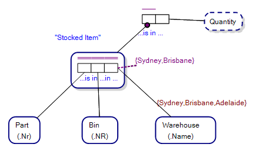

## 15.9 Equality Constraints

Equality Constraints constrain values for two Roles such that each Role has populating values equal to the same set. The Roles linked by a Equality Constraint join Compatible Object Types; and the Roles are generally not within the same Fact Type.

Equality Constraints are a type of Set Comparison Constraint.

The relationship between instance values that play the Roles linked by an Equality Constraint exist within a "if and only if" relationship. This means that either both instances exist or neither instance is allowed to exist.

For instance, in Figure 15.23, the Equality Constraint specifies that for each Person, that Person has some Registration Name if and only if that Person has some Birth Certificate. Which means there is no person that has a Birth Certificate and does not have a Registered Name and vice versa.

Equality constraints are drawn as a purple circle with an equals sign in it, with purple dashed links joining to the respective Roles joining the Compatible Object Types.

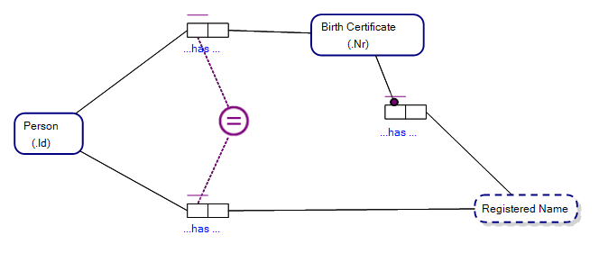

The verbalisation of the Equality Constraint in Figure 15.23 may be written one of two ways

…or…

## 15.10 Value Range Constraints

Value Range Constraints constrain population values for Roles of Fact Types to a range of values. For instance, in Figure 15.24, the Quantity of Parts within a Bin in a Warehouse, as a StockedItem, may be between 0 and 10 items. No other values are allowed in our Universe of Discourse. The Value Range Constraint is over the Value Type, Quantity.

Value Range Constraints are drawn as a range of values between parenthesis. Multiple ranges, comma separated, may appear within the parenthesis.

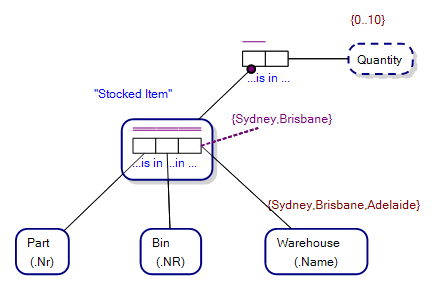

By way of example, the Universe of Discourse described by the ORM diagram above indicates that in a warehouse with bins storing parts, there is only allowable from 0 to 10 instances of that part in that bin and warehouse as a Stocked Item. Figure 15.25 shows a storeman reaching for a part in a bin (cubicle) in a warehouse.

**NB** We can have the same part in more than one bin at the same warehouse, so we can store more than 10 instances of the part in the warehouse, just not in the same bin.

## 15.11 Internal Frequency Constraints

Internal Frequency Constraints constrain the frequency of values in populations for Roles of Fact Types. For example, Figure 15.26 below, has an Internal Frequency Constraint over both of the Roles in the Fact Type, Person has Nick Name. The Internal Frequency Constraint linked to the Role played by Person (<=2) indicates that within our Universe of Discourse, each person may have at most 2 Nick Names. The Internal Frequency Constraint over the Role linked by Nick Name (<=4) indicates that within our Universe of Discourse there are at most 4 Nick Names in our Universe of Discourse.

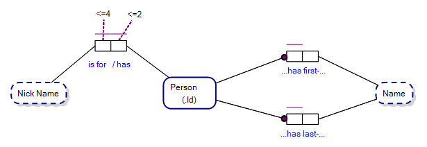

## 15.12 Subset Constraints

Subset Constraints constrain population values for one or more Roles as being a subset of population values for another set of one or more Roles. The Roles linked by a Subset Constraint join compatible Object Types and Roles are not generally within the same Fact Type.

Subset Constraints are a type of Set Comparison Constraint.

Subset Constraints have two varieties, Subset Constraints (regular) and Join Subset Constraints. Both types of Subset Constraint are represented as a purple less-than-or-equal sign with a surrounding purple circle, having links from the first set of one (Subset) or more (Join Subset) argument Roles to the set of one (Subset) or more (Join Subset) argument Roles.

## 15.13 Subset Constraints (regular)

Subset Constraints (regular) link two Roles, as the first argument and the second argument, where the first argument Role having instances that are a subset of instances of the second argument Role. The second argument link has an arrow, indicating the reading direction of the Subset Constraint. The links and arrows are drawn purple.

For instance, in Figure 15.27, the topmost External Role Constraint is a Subset Constraint that reads, If some Person has some Birth Certificate, then that Person was born. I.e. The set of people who play the Role of having a Birth Certificate, is a subset of the people that were born.

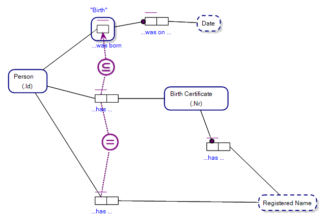

The following is how the Verbalisation of the Subset Constraint in Figure 15.27 would appear in Object-Role Modeling software:

### 15.13.1 Join Subset Constraints

Join Subset Constraints are Subset Constraints where the arguments range over a series/sequence of Roles. As per a Subset Constraint (regular), Join Subset Constraints constrain population values for one or more Roles as being a subset of population values for another set of one or more Roles. The Roles linked by a Subset Constraint join compatible Object Types and Roles are not generally within the same Fact Type. Join Subset Constraints constrain certain population values for one Join/Role Path as being a subset of population values for another Role Path:

Join Subset Constraints are a type of Set Comparison Constraint.

Join Subset Constraints are represented as a purple less-than-or-equal sign with a surrounding purple circle, with four purple dashed links to Roles. Two of the links are to the first and last arguments of the first join sequence and the second two links are to the first and last arguments of the second join sequence. Some software allows a single link for any of the two argument sequences that are split at the Role end, but this is not shown in this work.

An example makes it clear how Join Subset Constraints work. In Figure 15.29, the lowermost Subset Constraint, a Join Subset Constraint, has the verbalisation: If some Person has some Registered Name, then that Person has some Birth Certificate that has that Registered Name. The second argument sequences spans more than one Fact Type, and employs what is known as a Role Path or Join Path. A Role/Join Path consists of the set of Roles that are spanned by the Roles/Fact Types included in the Join Subset Constraint by virtue of the links from the Join Subset Constraint symbol.

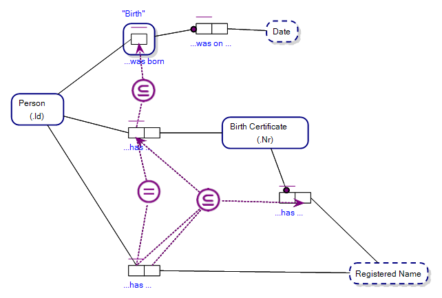

The following is how the Verbalisation of the Join Subset Constraint in Figure 15.29 would appear in Object-Role Modeling software:

## 15.14 Join/Role Path Disambiguation – Where it is possible without software

In Figure 15.29 above, the second argument sequence of the Join Subset Constraint is implied by the links from the Join Subset Constraint symbol, spanning the Fact Types, Person has Birth Certificate and Birth Certificate has Registered Name. With an infinite variety of possible graphical ORM diagrams, it is not always possible to infer the Role/Join Paths of a Join Subset Constraint. Role Paths may overlap, for instance, or have variable possible routes. This may lead to ambiguity in the Object-Role Model graphical notation. This author was able to demonstrate that it is possible to construct a graphical Object-Role Model where it is not possible to disambiguate a Join/Role Path without the use of software.

Verbalisations help to disambiguate a Join/Role Path, however this author knows of no accepted proof that a controlled natural language is unambiguous over an infinite variety of possible sentences under that controlled natural language.

Having said that, with the use of software, numbering and shading may be used to help disambiguate an Object-Role Model. For instance, in Figure 15.31 below, our Join Subset Constraint has the first (subset) Join/Role Path shaded light blue, and the second (superset) Join/Role Path shaded purple. The first and last arguments of each Join/Role Path are also numbered, 1.1, 1.2 and 2.1, 2.2. This helps to disambiguate the graphical notation of a Join Subset Constraint. Issues do arise, as we shall see, when Join/Role Paths overlap and where there is no extension to the graphical notation of ORM to help disambiguate every possible Object-Role Model with overlapping Join/Role Paths.

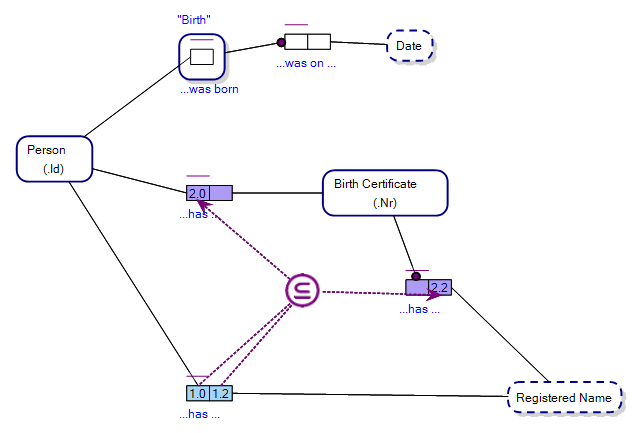

Let us take a look at another example of a Join Subset Constraint. Consider Figure 15.32 below. The Join Subset Constraint the top left of the ORM diagram has a verbalisation that reads:

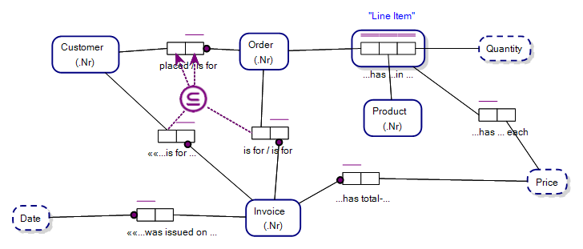

### 15.14.1 Example of Ambiguity – Join Subset Constraints

Consider this complex but valid graphical Object-Role Model, figure 15.33. The Universe of Discourse is to book tickets for a Round the World trip with an airline.

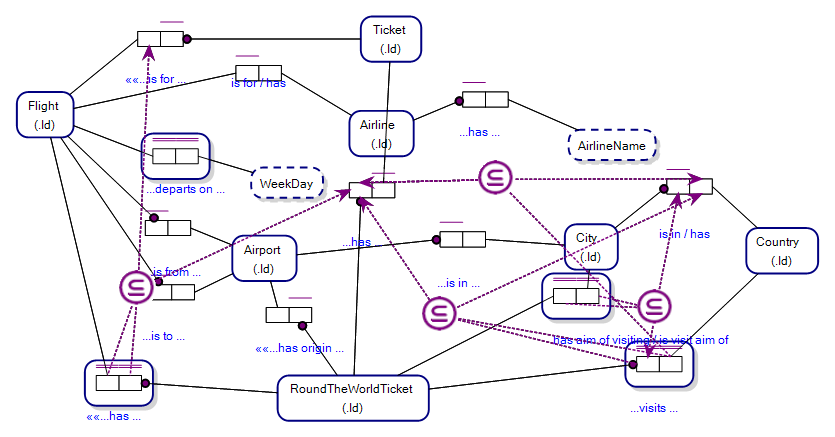

The topmost Join Subset Constraint, while syntactically valid is ambiguous in two ways:

1. It seems to lack one of the required 2 links indicating the first argument and second arguments of the first sequence (only one is visible, emanating from the bottom right of the diagram in the Fact Type, "Round the World Ticket visits Country"); and

2. We don't know whether the Join Subset Constraint reads:

…or…

If we put aside that one of the arguments in the first sequence is not visible, an aberration in the syntactic capability of graphical ORM diagrams (both arguments are the same Role in effect and one is not missing at all), we have the problem that is we highlight the join paths (Figure 15.34 below) the highlighting indicates overlapping join paths, and we cannot tell which constraint is has paths highlighted. We can't see or count through the join paths if we highlight the join paths of all Join Subset Constraints in the model, for instance, and some overlap. While a known problem in the Object Role Modeling graphical notation, it points out where further use of software to disambiguate the graphical notation is required. In software, for instance, we can select one Join Subset Constraint to highlight at a time.

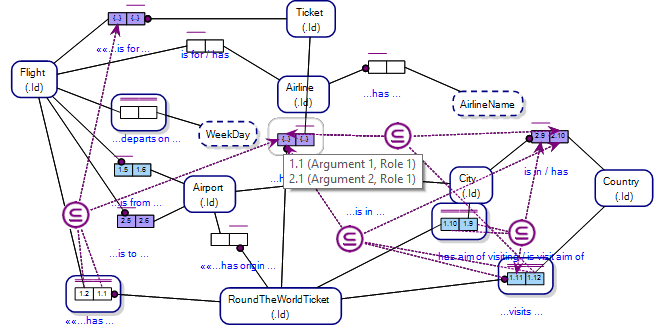

As noted above, without software generating the verbalisation of each constraint when selected in the software graphical user interface, the model would be completely ambiguous, and there is no accepted proof known to this author that proves all and any such controlled natural language verbalisations over an infinite variety of possible ORM models is possible.

## 15.15 Exclusion Constraints

Exclusion Constraints constrain population values for Roles joining compatible Object Types determining that a population value in the set of each Role excludes its existence within the set of population values for the other Roles linked by the Exclusion Constraint. Exclusion Constraints are over two or more Roles.

Exclusion Constraints are drawn as a purple circle with an internal cross, or X, with dashed purple links to the respective Roles of the constraint.

For example, in Figure 15.35, the Exclusion Constraint mandates that an Order was either made by phone or was made online, but not both.

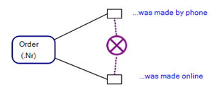

The following is how the Verbalisation of the Exclusion Constraint in Figure 15.35 would appear in Object-Role Modeling software:

## 15.16 Exclusive-Or Constraints

Exclusive-Or Constraints constrain population values for Roles joining compatible Object Types determining that a population value must appear against/for at least one of the Roles linked by the Exclusive-Or Constraint. Exclusive-Or Constraints are over two or more Roles.

Exclusive-Or Constraints are drawn as a purple circle with an X and a large purple dot within it's centre, with purple dashed links joining the respective Roles of the constraint.

For example, in Figure 15.37, the Exclusive-Or Constraint mandates that an Order must have been made by one of, "by phone" or "online", but not both.

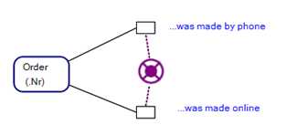

The following is how the Verbalisation of the Exclusive-Or Constraint in Figure 15.37 would appear in Object-Role Modeling software:

