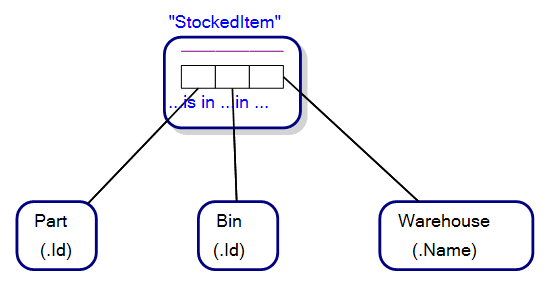
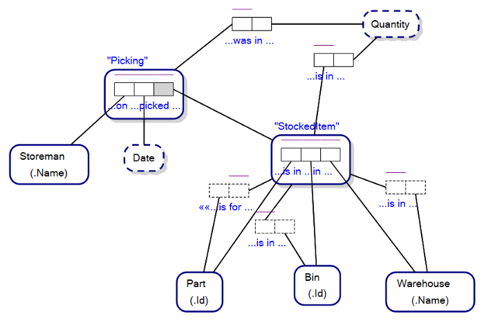
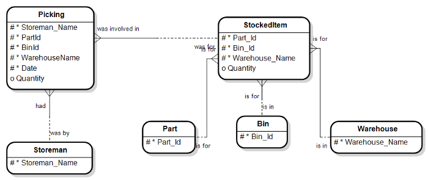

# Link/Implied Fact Types

One of the little known and understood features of Object-Role Modeling is the Link Fact Type. To understand Link Fact Types, let us look at an example of where and how they are used.

Imagine the Property Graph Schema below, and where you are creating a conceptual model for a graph database that stores information about parts stored in warehouses for an inventory software solution:
 
Figure 14.1   A Property Graph Schema for an Inventory Graph Database

Each StockedItem represents a part that is stored in a bin in a warehouse, and a distinguishing feature of property graph schemas is the named edge. Notice the named edges, is for, was for, was for, is in and is in. We can speak of the ‘is for’ edge, and the relationship between a StockedItem and the Part it represents as StockedItem is for Part.

We understand what we are talking about if we picture a real world scenario, where a storeman is reaching for a part in a bin in a warehouse.
 

Now examine the Object-Role Model below, also representing the conceptual model of parts in bins in warehouses:

Note that, on the face of it, each StockedItem does not have association with Fact Type Readings that read, StockedItem is for Part, StockedItem is in Bin and Stocked Item is in Warehouse. We say, “on the face of it”, because in this view of the ORM model we are not showing the Link/Implied Fact Types that are implied whenever we have an Objectified Fact Type, and where StockedItem is an Objectified Fact Type.

Part is in Bin in Warehouse is a Fact Type in ORM, and when objectified, we can think of the fact type/relationship as if it were an ostensible node in our Property Graph Schema; in our case, StockedItem.

Let us now look at the implied Link Fact Types for StockedItem in our Object-Role Model. The Link Fact Types are the Fact Types with Roles with a dashed outline:

Now we do have Fact Type Readings that read, StockedItem is for Part, StockedItem is in Bin and Stocked Item is in Warehouse.

Link Fact Types are as simple as that. For each Objectified-Fact Type there is a set of Link/Implied Fact Types joining to the respective model elements that play roles in the Objectified-Fact Type.
The beauty of Object-Role Modeling, of course, is that once you have created the ORM diagram, you can convert it to a Property Graph Schema or an Entity-Relationship Diagram, as below:
 

Note how the predicate parts ‘is for’, ‘is in’ and ‘is in’, for their respective Fact Type carry over to our Entity Relationship Diagram as well.

As a bonus to Object-Role Modeling, you get to capture the predicated reading ‘Part is in Bin in Warehouse’ also, further adding to the semantics of the conceptual model you are creating. This level of detail is not otherwise available in Property Graph Schema or Entity-Relationship Diagrams.

--

(c) Copyright Victor Morgante/FactEngine.AI
